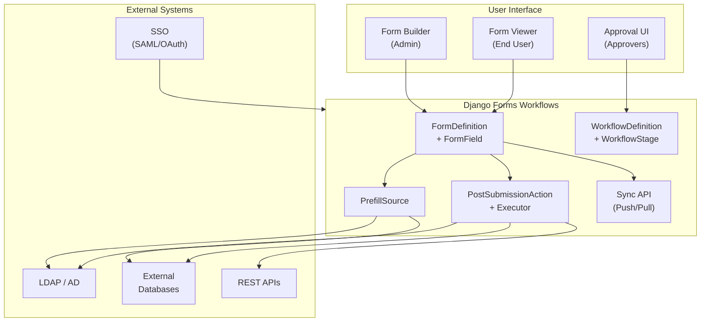

# Django Forms Workflows

**Enterprise-grade, database-driven form builder with multi-stage approval workflows, external data integration, and cross-instance sync**

[](https://www.gnu.org/licenses/lgpl-3.0)
[](https://www.python.org/downloads/)
[](https://www.djangoproject.com/)
[](https://github.com/opensensor/django-forms-workflows)

## Overview

Django Forms Workflows bridges the gap between simple form libraries (like Crispy Forms) and expensive SaaS solutions (like JotForm, Formstack). It provides:

- 📝 **Database-Driven Forms** — Define forms in the database, not code. 15+ field types, validation rules, and conditional logic.
- 🔄 **Multi-Stage Approval Workflows** — Sequential, parallel, or hybrid approval flows with configurable stages.
- 🔀 **Sub-Workflows** — Spawn child workflows from a parent submission (e.g. one form creates N payment approvals).
- 🔌 **External Data Integration** — Prefill fields from LDAP, databases, REST APIs, or the Django user model.
- ⚡ **Post-Submission Actions** — Trigger emails, database writes, LDAP updates, or custom Python handlers on submit/approve/reject.
- 🔄 **Cross-Instance Sync** — Push/pull form definitions between environments directly from the Django Admin.
- 🔒 **Enterprise Security** — LDAP/AD & SSO authentication, RBAC, complete audit trails.
- 📁 **Managed File Uploads** — File uploads with approval, rejection, and version tracking per submission.
- 🏠 **Self-Hosted** — No SaaS fees, full data control.

## Key Features

### 🎯 No-Code Form Creation
Business users create and modify forms through Django Admin:
- 15+ field types (text, email, select, radio, checkbox, date, time, datetime, decimal, number, phone, URL, file, textarea, hidden, section headers)
- Field ordering with drag-and-drop
- Validation rules (required, regex, min/max length, min/max value)
- Conditional field visibility (`show_if_field` / `show_if_value`)
- Custom help text, placeholders, and CSS classes
- Read-only and pre-filled fields
- Draft saving with auto-save support

### 🔄 Multi-Stage Approval Workflows
Flexible approval engine with two modes:

**Legacy (flat) mode** — approval groups assigned directly to the workflow:
- `any` — first approval from any group finalizes
- `all` — every group must approve
- `sequence` — groups approve in order

**Staged mode** — named `WorkflowStage` records with per-stage logic:
- Each stage has its own approval groups and logic (`any` / `all`)
- Stages execute in order; next stage unlocks when the current one completes
- Stage-specific form fields (e.g. approver notes, signature date) appear only during that stage
- Configurable stage labels (e.g. "Sign Off" instead of "Approve")

Both modes support:
- Email notifications and configurable reminder cadence (`daily` / `weekly` / `none`)
- Escalation routing when a form field exceeds a threshold (e.g. amount > $5 000)
- Rejection handling with per-stage or global rejection semantics
- Complete audit trail on every approval, rejection, and status change

### 🔀 Sub-Workflows
Spawn child workflow instances from a parent submission:
- `SubWorkflowDefinition` links a parent workflow to a child form definition
- `count_field` controls how many sub-workflows to create (driven by a form field value)
- `data_prefix` slices the parent's form data to populate each child
- Triggered `on_approval`, `on_submit`, or `manual`

### 🔌 Configurable Prefill Sources
Populate form fields automatically from reusable `PrefillSource` records:
- **User model** — `user.email`, `user.first_name`, `user.username`, etc.
- **LDAP / Active Directory** — any LDAP attribute (department, title, manager, custom)
- **External databases** — schema/table/column lookup with template support for multi-column composition
- **Custom database queries** — reference a named query via `database_query_key`
- **System values** — `current_date`, `current_time`

> **Legacy support:** the plain-text `prefill_source` string field on `FormField` is still honoured for backwards compatibility. When both `prefill_source` and the FK `prefill_source_config` are set, the FK takes priority.

### ⚡ Post-Submission Actions
Automatically run side-effects after a submission event:

| Trigger | Description |
|---------|-------------|
| `on_submit` | Runs immediately on form submission |
| `on_approve` | Runs when the submission is approved |
| `on_reject` | Runs when the submission is rejected |
| `on_complete` | Runs when the entire workflow completes |

**Action types:** `email`, `database`, `ldap`, `api`, `custom`

**Features:**
- Conditional execution with 10 operators (`equals`, `not_equals`, `greater_than`, `less_than`, `contains`, `not_contains`, `is_empty`, `is_not_empty`, `is_true`, `is_false`, plus date comparisons)
- Automatic retries with configurable `max_retries`
- Execution ordering for dependent actions
- Idempotent locking (`is_locked`) to prevent double-execution
- Full execution logging via `ActionExecutionLog`
- Pluggable handler architecture — register custom handlers for new action types

### 🔄 Cross-Instance Form Sync
Move form definitions between environments from the Django Admin:
- **Pull from Remote** — connect to a configured remote instance and import selected forms
- **Push to Remote** — select forms and push to any destination
- **Import / Export JSON** — portable `.json` snapshots
- **Conflict modes** — `update`, `skip`, or `new_slug`
- **`FORMS_SYNC_REMOTES`** setting — pre-configure named instances (URL + token)
- HTTP endpoints protected by Bearer token for CI/scripted use

### 📁 Managed File Uploads
- `FileUploadConfig` per form definition (allowed extensions, max size)
- `ManagedFile` records with approval/rejection/supersede lifecycle
- Version tracking with `is_current` flag

### 🔒 Enterprise-Ready Security
- LDAP/Active Directory authentication with auto-sync of profile attributes
- SSO integration (SAML, OAuth) with attribute mapping to `UserProfile`
- Role-based access: `submit_groups` and `view_groups` on `FormDefinition`
- Group-based approval routing via `WorkflowStage.approval_groups`
- Complete audit logging (`AuditLog` — who, what, when, IP address)
- `UserProfile` auto-created on first login with LDAP/SSO sync

## Quick Start

### Installation

```bash
pip install django-forms-workflows
```

### Setup

1. Add to `INSTALLED_APPS`:

```python
INSTALLED_APPS = [
    # ...
    'crispy_forms',
    'crispy_bootstrap5',
    'django_forms_workflows',
]

CRISPY_ALLOWED_TEMPLATE_PACKS = "bootstrap5"
CRISPY_TEMPLATE_PACK = "bootstrap5"
```

2. Include URLs and run migrations:

```python
# urls.py
urlpatterns = [
    path('forms/', include('django_forms_workflows.urls')),
]
```

```bash
python manage.py migrate django_forms_workflows
```

3. Create your first form in Django Admin!

### Optional Settings

```python
FORMS_WORKFLOWS = {
    "LDAP_SYNC": {
        "enabled": True,
        "attributes": {
            "department": "department",
            "title": "title",
            "employee_id": "extensionAttribute1",
        },
    },
}

# Cross-instance sync
FORMS_SYNC_API_TOKEN = "shared-secret"
FORMS_SYNC_REMOTES = {
    "production": {
        "url": "https://prod.example.com/forms-sync/",
        "token": "prod-token",
    },
}
```

## Architecture



## Use Cases

- **HR** — Onboarding, time-off requests, expense reports, status changes
- **IT** — Access requests, equipment requests, change management
- **Finance** — Purchase orders, invoice approvals, budget requests
- **Education** — Student applications, course registrations, facility booking
- **Healthcare** — Patient intake, referrals, insurance claims
- **Government** — Permit applications, FOIA requests, citizen services

## Comparison

| Feature | Django Forms Workflows | Crispy Forms | FormStack | Django-Formtools |
|---------|----------------------|--------------|-----------|------------------|
| Database-driven forms | ✅ | ❌ | ✅ | ❌ |
| No-code form creation | ✅ | ❌ | ✅ | ❌ |
| Self-hosted | ✅ | ✅ | ❌ | ✅ |
| Multi-stage approval workflows | ✅ | ❌ | ⚠️ | ❌ |
| Sub-workflows | ✅ | ❌ | ❌ | ❌ |
| Post-submission actions | ✅ | ❌ | ⚠️ | ❌ |
| External data prefill | ✅ | ❌ | ⚠️ | ❌ |
| Cross-instance sync | ✅ | ❌ | ❌ | ❌ |
| LDAP/AD + SSO integration | ✅ | ❌ | ❌ | ❌ |
| Managed file uploads | ✅ | ❌ | ✅ | ❌ |
| Audit trail | ✅ | ❌ | ✅ | ❌ |
| Open source | ✅ | ✅ | ❌ | ✅ |

## Requirements

- Python 3.10+
- Django 5.1+
- PostgreSQL, MySQL, or SQLite (PostgreSQL recommended for production)
- Optional: Celery 5.0+ with Redis/Valkey for background task processing

## Testing

```bash
cd django-forms-workflows
pip install pytest pytest-django
python -m pytest tests/ -v
```

The test suite covers models, forms, workflow engine, sync API, post-submission action executor, views, signals, and utilities — 150+ tests.

## Contributing

We welcome contributions! Please see [CONTRIBUTING.md](CONTRIBUTING.md) for details.

## License

GNU Lesser General Public License v3.0 (LGPLv3) — see [LICENSE](LICENSE) for details.

## Support

- 📖 [Documentation](https://django-forms-workflows.readthedocs.io/)
- 💬 [Discussions](https://github.com/opensensor/django-forms-workflows/discussions)
- 🐛 [Issue Tracker](https://github.com/opensensor/django-forms-workflows/issues)

## Roadmap

### ✅ Delivered
- [x] Database-driven form definitions with 15+ field types
- [x] Dynamic form rendering with Crispy Forms
- [x] Multi-stage approval workflows (legacy flat + staged)
- [x] Sub-workflow support
- [x] LDAP/AD integration with profile sync
- [x] SSO attribute mapping
- [x] Configurable prefill sources (user, LDAP, database, API)
- [x] Post-submission actions with conditional execution & retries
- [x] Cross-instance form sync (push/pull/JSON import-export)
- [x] Managed file uploads with approval lifecycle
- [x] Conditional field visibility (client-side)
- [x] Form templates and cloning
- [x] Complete audit logging
- [x] Comprehensive test suite (150+ tests)

### 🚧 In Progress
- [ ] Dashboard analytics
- [ ] REST API for form submission
- [ ] Webhook support

### 📋 Planned
- [ ] Custom field types (signature, location, barcode)
- [ ] Advanced reporting and export
- [ ] Form versioning with diff tracking
- [ ] Multi-tenancy support
- [ ] Plugin / handler marketplace

## Credits

Built with ❤️ by the Django community.

Special thanks to:
- [Django Crispy Forms](https://github.com/django-crispy-forms/django-crispy-forms)
- [Celery](https://github.com/celery/celery)
- [django-auth-ldap](https://github.com/django-auth-ldap/django-auth-ldap)
